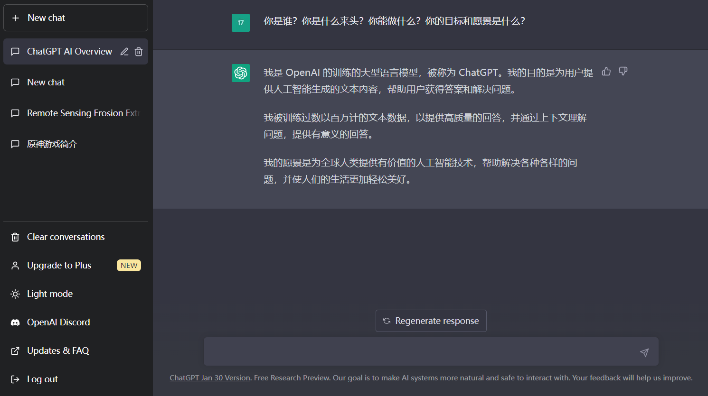

2022年11月30日由OpenAI正式发布上线。使命是"to make AI systems more natural and safe to interact with"。OpenAI是一家独角兽，于2015年由包括Elon Musk、LinkedIn联合创始人Reid Hoffman、PayPal创始人Peter Thiel等一群科技领袖创办。

https://www.bilibili.com/video/BV1AF411b7xQ/?spm_id_from=333.999.0.0&vd_source=3b0fca0d89bd5a77cb76030b36b9b11b)

ChatGPT的底层是AIGC和nlp，业务价值是流量变现，赋能传统行业，价值观是"to make AI systems more natural and safe to interact with."，方针是深耕国内心怀全球，以超量数据为抓手，倒逼众源数据优化形成闭环。（假）

OpenAI的其它优秀产品例如有copilot。目前，ChatGPT在中国大陆地区（含香港）、俄罗斯地区不可用。

OpenAI只能根据2020年以前的互联网数据回答问题。

其它更多的了解视频：

[单卡、多卡 BERT、GPT2 训练性能【100亿模型计划】_哔哩哔哩_bilibili](https://www.bilibili.com/video/BV1fG411G7eH/?spm_id_from=333.999.0.0)

[环境安装，BERT、GPT、T5 性能测试，和横向对比【100亿模型计划】_哔哩哔哩_bilibili](https://www.bilibili.com/video/BV1LT411F77M/?spm_id_from=333.999.0.0&vd_source=3b0fca0d89bd5a77cb76030b36b9b11b)

[GPT，GPT-2，GPT-3 论文精读【论文精读】_哔哩哔哩_bilibili](https://www.bilibili.com/video/BV1AF411b7xQ/?spm_id_from=333.999.0.0&vd_source=3b0fca0d89bd5a77cb76030b36b9b11b)